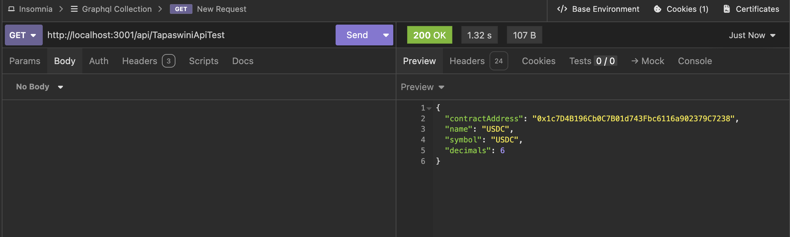
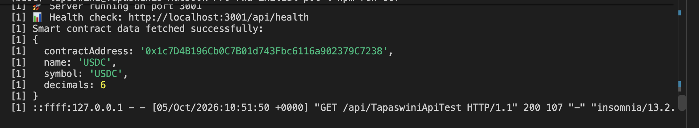

# Engineering Assessment

## 📝 Objective

The goal of this assessment is to evaluate your ability to:

Work with Web3 technologies and integrate blockchain functionality into a decentralized application (dApp).

---

## 📌 Task Instructions

1. **Create a New API Endpoint**

   - Add a new API endpoint in `src/server/server.js` named:

     ```
     [Your Name]ApiTest
     ```

2. **Smart Contract Interaction**

   - Select any **pre-deployed** or **public smart contract** (mainnet or testnet).
   
   - Fetch some data (any useful information such as balance, contract state, or public variables).
   
   - The logic should fetch data through your new API endpoint.


3. **Output**

   - The result should be printed to the console.
   - No need for complex UI or data persistence 
   - just demonstrate that the data was fetched successfully.

---

## 📤 Submission

Once completed, submit the deliverables in the following three forms:

- **short video** recording (3-5 mins) your code and result using loom.com
- **screenshots** showing the API call and console result.
- Upload the project you worked on to your **GitHub puclic link and share it**

---

## ⏰ Time Expectation

- Estimated time to complete: **30–60 minutes**.

---

## ⚙️ Notes

You may use any blockchain provider such as:

  - **ethers.js**
  - **web3.js**
  - Any public RPC provider (Infura, Alchemy, QuickNode, etc.)
  
Keep your code **clean, simple, and easy to review**.

Handle errors gracefully where possible.

---
## 🚀 Quick Start Guide

To run the project locally:

```bash
# Clone the repository (if provided)
git clone [repo-url]

# Move into the project directory
cd [project-folder]

# Install dependencies
npm install

# Start the server
npm run dev
```

---

## [Submission]

**Reviewer:** Tapaswini
**Scope:** Code review / feedback on the `rwa-initial-poc` (RWA Tokenization Platform) PoC shared for this assessment, plus completion of the Web3 API task above.

### 0. Critical — malware found in the repo (fixed locally, needs attention upstream)

Before reviewing anything else: four files in this repo — `src/server/server.js`, `src/server/config/index.js`, `postcss.config.js`, and `src/components/TestSolidity/hardhat.config.cjs` — had a large block of obfuscated JavaScript appended after the legitimate code (byte-identical payload in all four, starting with `global.o='5-2-67-du';var _$_5be5=...`). These are all files that execute automatically during normal project use (Vite loads `postcss.config.js` on `npm run dev`, the other three run on backend start / Hardhat commands), which is the hallmark of a deliberately placed backdoor rather than an accident — a pattern seen in fake take-home-assessment repos used to compromise developer machines. I stripped the payload out of my local copy before doing anything else (confirmed `node_modules` had never been installed, so nothing had executed). **This should be traced back to where the fork originated and purged from the source repository** — if it's present there too, anyone else who clones it and runs `npm install && npm run dev` is at risk.

### 1. Web3 API task

Implemented at `GET /api/TapaswiniApiTest` in `src/server/server.js`: uses `ethers.js` v5 against a public Sepolia testnet RPC to read `name`, `symbol`, and `decimals` from a deployed USDC-style ERC-20 contract, logs the result to console, and returns it as JSON. Verified working end-to-end locally. See the README for a `curl` example.

**API call (Insomnia):**



**Server console result:**



Video walkthrough (Loom): https://www.loom.com/share/50338773f87c4e5189aff25cddb723a4

### 2. Strengths

- Sensible route separation on the backend (`assets`, `validators`, `transactions`, `dashboard`, `auth`, `ipfs`), with `helmet`, `cors`, rate limiting, `compression`, and `morgan` wired into `server.js`.
- The core `RWABToken` contract design (`src/contracts/RWABToken.sol`, consumed by `src/utils/web3.ts`) is ambitious for a PoC — ERC-1155-based with identity registry/compliance hooks, freeze/unfreeze, forced transfer, and recovery functions, which reflects real-world security-token requirements rather than a toy ERC-20.
- IPFS integration (`pinata`, `ipfs-http-client`) for asset metadata is a reasonable choice for the stated tokenization workflow.
- Mock data (`src/server/models/database.js`) is detailed enough to exercise the full intended asset lifecycle in the UI without a real database.

### 3. Issues / gaps worth addressing

- **No persistence**: `src/server/models/database.js` is an in-memory `Map`-based mock; `DATABASE_URL` in `.env` is unused. Fine for a PoC, but should be called out explicitly as a known limitation rather than implied as "for future use" with no tracking issue.
- **Dead/unwired security middleware**: `src/server/middleware/auth.js` defines `corsOptions`, `securityHeaders`, and a custom `errorHandler`, but `server.js` doesn't use any of them — it builds its own inline `cors()`/`helmet()` config instead. Either consolidate on one, or the extra middleware is dead code.
- **Insecure mock wallet generation**: in `src/server/routes/auth.js`, new users get a "wallet" via `` `0x${Math.random().toString(16).substr(2, 40)}` `` — not a valid derived address and not cryptographically random. Fine as a placeholder, but worth a comment flagging it as non-production, since it's easy to mistake for a real wallet integration.
- **Default/fallback secrets**: `JWT_SECRET` falls back to `'fallback-secret'` in both `src/server/middleware/auth.js` and `src/server/config/index.js` if the env var is missing, with no startup check that fails loudly in production. `validateConfig()` in `config/index.js` does check for this, but that file isn't actually `require`d anywhere in the codebase — it's orphaned, and that validation never runs.
- **Duplicated, diverging API client code**: `src/api/assetApi.ts` and `src/services/api/assetApi.ts` are two different implementations of the same client, not a re-export. Both also hardcode API base URLs using `process.env.REACT_APP_API_BASE_URL` / `process.env.NEXT_PUBLIC_API_URL` — neither works in this Vite app (Vite exposes env vars via `import.meta.env.VITE_*`), so API base URL resolution is silently broken in both files. Same duplication pattern shows up for `dashboard` and `validatorApi`.
- **Two unrelated Solidity projects in one repo**: `src/contracts/` holds the real RWAB token/KYC/marketplace contracts referenced by the frontend, while `src/components/TestSolidity/` is a separate, self-contained Hardhat project (own `package.json`, `hardhat.config.cjs`, `artifacts/`, `cache/`) with a generic `Token.sol`/`SafeMath.sol`/etc. that appears unrelated to the main contracts and is oddly nested inside `src/components`. Worth clarifying whether it's a scratch sandbox that should be removed or moved out of `src/`.
- **Tests exist but aren't runnable via npm**: `tests/` has four suites (`api`, `assets`, `auth`, `middleware`) using `jest`/`supertest`, both listed in `devDependencies`, but `package.json` has no `"test"` script and no Jest config — so CI/reviewers can't just run `npm test`.
- **`.env` was committed to git** with placeholder secrets (not real credentials, but still bad practice) — removed from tracking going forward via `.gitignore`.

### 4. Suggested next steps (priority order)

1. Confirm and remediate the obfuscated-code issue in the source repository, not just this fork.
2. Add a `"test": "jest"` script and get the existing suites running in CI.
3. Pick one `assetApi`/`dashboard`/`validatorApi` client implementation per resource, delete the other, and fix env var access to use `import.meta.env.VITE_*`.
4. Decide the fate of `src/components/TestSolidity/` (remove, or move to a top-level `contracts-sandbox/` outside `src/`).
5. Wire `validateConfig()` into actual startup (or delete `config/index.js` if it's meant to be replaced by the simpler `.env` + inline config already used in `server.js`).
